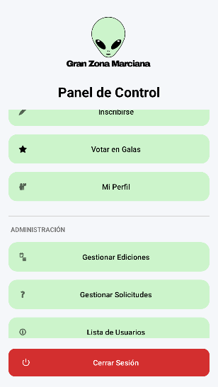
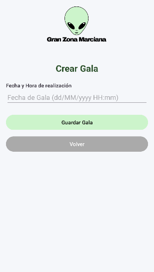
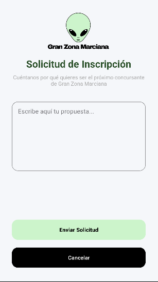

# 👽 Gran Zona Marciana

<div align="center">


**Sistema de Gestión Integral para Reality Shows**

*Una aplicación móvil nativa para Android diseñada para centralizar la interacción entre la producción, los participantes y la audiencia de un reality show*

[Características](#-características-principales) • [Tecnologías](#-stack-tecnológico) • [Capturas](#-capturas-de-pantalla) • [Instalación](#-instalación) • [Uso](#-guía-de-uso)

---

**Desarrollado por el equipo Ecentia**

</div>

---

## 📋 Tabla de Contenidos

- [Descripción](#-descripción-del-proyecto)
- [Características Principales](#-características-principales)
- [Stack Tecnológico](#-stack-tecnológico)
- [Capturas de Pantalla](#-capturas-de-pantalla)
- [Roles del Sistema](#-roles-del-sistema)
- [Arquitectura](#-arquitectura)
- [Instalación](#-instalación)
- [Guía de Uso](#-guía-de-uso)
- [Base de Datos](#-base-de-datos)
- [Estructura del Proyecto](#-estructura-del-proyecto)
- [Contribuir](#-contribuir)
- [Licencia](#-licencia)
- [Equipo](#-equipo-de-desarrollo)

---

## 📱 Descripción del Proyecto

**Gran Zona Marciana** es una aplicación móvil nativa para Android que revoluciona la forma de gestionar reality shows. Ofrece una solución completa y robusta para la administración de usuarios, eventos y votaciones, adaptando su interfaz según el rol del usuario (Administrador, Concursante o Espectador).

### 🎯 ¿Por qué Gran Zona Marciana?

- ✅ **Gestión Centralizada**: Todo el control del reality en una app
- ✅ **Seguridad Robusta**: Encriptación BCrypt y gestión de sesiones
- ✅ **Modo Offline**: Funciona sin conexión constante
- ✅ **Experiencia Personalizada**: UI adaptada a cada tipo de usuario
- ✅ **Escalable**: Preparada para múltiples ediciones y miles de usuarios

---

## ✨ Características Principales

### 🔐 Autenticación y Seguridad
- 🔒 Login seguro con encriptación BCrypt
- 👤 Gestión de sesiones persistentes
- 🛡️ Sistema de permisos basado en roles
- 🔑 Validación robusta de datos de entrada

### 📊 Gestión Administrativa
- 📅 **Ediciones**: Crear y gestionar temporadas del reality
- 🎭 **Galas**: Programación de eventos con validación de fechas
- 📰 **Noticias**: Sistema de publicación con imágenes
- ✅ **Solicitudes**: Aprobación de nuevos concursantes
- 👥 **Usuarios**: CRUD completo con filtros por rol

### 🗳️ Sistema de Votación
- ⭐ Puntuación de concursantes (escala 1-10)
- 📊 Cálculo de medias automático
- 🚫 Prevención de votos duplicados
- 📈 Estadísticas en tiempo real

### 🎨 Diseño Material
- 🌈 Paleta de colores personalizada (#CCF4CB, #2D522C)
- 📱 Componentes Material Design 3
- 🔄 Animaciones fluidas
- 📐 Layouts responsivos

---

## 🛠️ Stack Tecnológico

<table>
<tr>
<td width="50%">

### Core Technologies
```yaml
Language: Java ☕
SDK: Android 8.0+ (API 26-34)
IDE: Android Studio
Build: Gradle 8.13
Min SDK: 26
Target SDK: 34
```

</td>
<td width="50%">

### Libraries & Dependencies
```yaml
Room: 2.6.1 🗄️
BCrypt: 0.4.3 🔐
Picasso: 2.8 🖼️
Material: 1.12.0 🎨
LiveData: Reactive 🔄
ConstraintLayout: 2.1.4 📐
```

</td>
</tr>
</table>

---

## 📸 Capturas de Pantalla

<div align="center">

### 🔐 Autenticación

<table>
<tr>
<td width="50%" align="center">


**🔑 Pantalla de Login**

*Autenticación segura con validación y encriptación BCrypt*

</td>
<td width="50%" align="center">


**📝 Registro de Usuario**

*Formulario completo con validaciones en tiempo real*

</td>
</tr>
</table>

---

### 🏠 Panel Principal

<table>
<tr>
<td align="center">



**🎛️ Menú Principal**

*Dashboard adaptado según rol del usuario con accesos directos*

</td>
</tr>
</table>

---

### 📰 Gestión de Contenido

<table>
<tr>
<td width="50%" align="center">


**📢 Crear/Editar Noticia**

*Publicación de noticias con soporte para imágenes externas*

</td>
<td width="50%" align="center">


**📅 Gestionar Edición**

*Control de temporadas del reality con validación de fechas*

</td>
</tr>
</table>

---

### 🎭 Galas y Eventos

<table>
<tr>
<td align="center">



**🎊 Programar Gala**

*Creación de eventos con selector de fecha/hora interactivo*

</td>
</tr>
</table>

---

### 🗳️ Sistema de Votación e Inscripciones

<table>
<tr>
<td width="50%" align="center">


**⭐ Emitir Puntuación**

*Sistema de votación con validaciones anti-duplicados*

</td>
<td width="50%" align="center">



**📝 Solicitud de Inscripción**

*Formulario para aspirantes a concursantes del reality*

</td>
</tr>
</table>

> 💡 **Nota**: Para visualizar correctamente las capturas, asegúrate de que las imágenes estén en la carpeta `screenshots/` en la raíz del proyecto.

</div>

---

## 👥 Roles del Sistema

<div align="center">

<table>
<tr>
<td width="33%" align="center">

### 👨‍💼 ADMINISTRADOR


**Control Total del Sistema**

</td>
<td width="33%" align="center">

### 🎭 CONCURSANTE


**Participación Activa**

</td>
<td width="33%" align="center">

### 👀 ESPECTADOR


**Interacción Básica**

</td>
</tr>
<tr>
<td valign="top">

#### Permisos:
- ✅ Gestionar usuarios
- ✅ Crear ediciones
- ✅ Programar galas
- ✅ Publicar noticias
- ✅ Aprobar solicitudes
- ✅ Crear administradores
- ✅ Ver estadísticas globales
- ✅ Eliminar contenido

</td>
<td valign="top">

#### Permisos:
- ✅ Ver noticias
- ✅ Votar en galas
- ✅ Ver estadísticas propias
- ✅ Editar perfil personal
- ✅ Consultar calendario
- ✅ Ver ranking
- ✅ Acceder a retos

</td>
<td valign="top">

#### Permisos:
- ✅ Ver noticias
- ✅ Votar en galas
- ✅ Enviar solicitudes
- ✅ Editar perfil personal
- ✅ Seguir concursantes
- ✅ Ver resultados
- ✅ Consultar info pública

</td>
</tr>
</table>

</div>

---

## 🏗️ Arquitectura

### Patrón MVC Adaptado con Room

```
┌─────────────────────────────────────────────────────────────┐
│                    PRESENTATION LAYER                        │
│                                                              │
│  ┌──────────┐  ┌──────────┐  ┌──────────┐  ┌──────────┐   │
│  │MainActivity│ │  Menu    │  │ Form*    │  │  List*   │   │
│  └──────────┘  └──────────┘  └──────────┘  └──────────┘   │
│         │              │              │              │       │
│         └──────────────┴──────────────┴──────────────┘      │
└───────────────────────────┬─────────────────────────────────┘
                            │
┌───────────────────────────┴─────────────────────────────────┐
│                   BUSINESS LOGIC LAYER                       │
│                                                              │
│  ┌────────────┐  ┌────────────┐  ┌────────────┐           │
│  │ Services   │  │  Adapters  │  │ Validators │           │
│  └────────────┘  └────────────┘  └────────────┘           │
└───────────────────────────┬─────────────────────────────────┘
                            │
┌───────────────────────────┴─────────────────────────────────┐
│                   DATA ACCESS LAYER                          │
│                                                              │
│  ┌─────────────────────────────────────────────────────┐   │
│  │           Room Database (SQLite)                     │   │
│  │  ┌─────────┐  ┌─────────┐  ┌──────────┐           │   │
│  │  │  DAOs   │◄─┤ Entities│◄─┤Converters│           │   │
│  │  └─────────┘  └─────────┘  └──────────┘           │   │
│  └─────────────────────────────────────────────────────┘   │
└─────────────────────────────────────────────────────────────┘
```

### Componentes Clave

#### 📦 Entities (Modelos de Datos)
```java
// Jerarquía de herencia
Actor (abstracta)
├── Usuario
├── Administrador
├── Concursante
└── Espectador

// Entidades independientes
Edicion, Gala, Noticia, Puntuacion, Solicitud
```

#### 🔌 DAOs (Data Access Objects)
Interfaces con métodos anotados para operaciones CRUD:
```java
@Insert    // Insertar nuevo registro
@Update    // Actualizar registro existente
@Delete    // Eliminar registro
@Query     // Consultas personalizadas con LiveData
@Transaction  // Operaciones complejas con relaciones
```

#### 🎨 Services (Lógica de Negocio)
Capa intermedia que encapsula la lógica:
```java
public class UsuarioService {
    private UsuarioDao dao;
    private ExecutorService executor;
    
    public LiveData<List<Usuario>> listarUsuarios() {...}
    public void insertarUsuario(Usuario u) {...}
    public void actualizarUsuario(Usuario u) {...}
}
```

---

## 📥 Instalación

### Prerrequisitos

<table>
<tr>
<td width="50%">

#### 🖥️ Software Necesario
- ✅ Android Studio Ladybug (2024.2.1+)
- ✅ JDK 21 o superior
- ✅ Git
- ✅ Dispositivo Android o Emulador

</td>
<td width="50%">

#### 📱 Requisitos del Dispositivo
- ✅ Android 8.0 (API 26) o superior
- ✅ 50 MB de espacio libre
- ✅ Conexión a internet (opcional)
- ✅ Permisos de almacenamiento

</td>
</tr>
</table>

### Pasos de Instalación

#### 1️⃣ Clonar el Repositorio

```bash
git clone https://github.com/ecentia/gran-zona-marciana.git
cd gran-zona-marciana
```

#### 2️⃣ Abrir en Android Studio

```
File → Open → Seleccionar la carpeta del proyecto
```

Espera a que Android Studio indexe el proyecto.

#### 3️⃣ Sincronizar Dependencias

Android Studio sincronizará automáticamente. Si no:
```
File → Sync Project with Gradle Files
```

O hacer clic en el icono 🐘 de Gradle en la barra superior.

#### 4️⃣ Configurar Dispositivo

**Opción A - Emulador:**
```
Tools → Device Manager → Create Device
Seleccionar: Pixel 6 Pro con API 34 (Android 14)
```

**Opción B - Dispositivo Físico:**
```bash
# En el dispositivo:
Configuración → Acerca del teléfono 
→ Pulsar 7 veces "Número de compilación"
→ Activar "Opciones de desarrollador"
→ Activar "Depuración USB"

# Conectar el dispositivo al PC y aceptar permisos
```

#### 5️⃣ Ejecutar la App

```
Run → Run 'app' (Shift + F10)
```

O hacer clic en el botón ▶️ verde en la barra superior.

### 🔑 Credenciales de Prueba

Al iniciar por primera vez, la app crea automáticamente un administrador:

```yaml
Usuario: admin
Contraseña: admin123
Rol: ADMINISTRADOR
```

> ⚠️ **Seguridad**: Cambiar estas credenciales en entorno de producción

---

## 🎮 Guía de Uso

### 🔐 Inicio de Sesión

<table>
<tr>
<td width="60%">

#### 🆕 Primera Vez (Nuevo Usuario)
1. Abrir la aplicación
2. Clic en "**¿Aún no tienes una cuenta?**"
3. Completar el formulario de registro
4. Por defecto serás **Espectador**
5. Iniciar sesión con tus nuevas credenciales

#### 👤 Usuario Existente
1. Introducir usuario y contraseña
2. Clic en "**Identificarse**"
3. La app recordará tu sesión
4. Próximos inicios: acceso directo al menú

</td>
<td width="40%">

```
┌─────────────┐
│   🔐 Login  │
└──────┬──────┘
       │
   ┌───┴────┐
   │ Valid? │
   └───┬────┘
      Yes│
   ┌─────┴────┐
   │ 🏠 Menu  │
   └──────────┘
```

</td>
</tr>
</table>

---

### 📰 Gestionar Noticias (👨‍💼 Administrador)

```
Menu → Ver Noticias → Botón "+" → Formulario
```

**Paso a paso:**
1. **Título**: Encabezado llamativo (ej: "¡Nueva Gala este Viernes!")
2. **Contenido**: Cuerpo de la noticia (descripción completa)
3. **URL Imagen**: Enlace a imagen externa (opcional)
4. **Guardar**: La noticia aparece inmediatamente en el listado

> 💡 **Tip**: Usa servicios como Imgur, Google Drive o Pinterest para alojar imágenes

**Editar o Eliminar:**
- **Editar**: Pulsar sobre una noticia
- **Eliminar**: Icono 🗑️ en cada item

---

### 🗳️ Votar en Galas (👥 Todos los Usuarios)

```
Menu → Votar en Galas → Seleccionar Gala → Formulario
```

**Proceso de votación:**
1. **Seleccionar Gala**: Lista de galas disponibles
2. **ID Concursante**: Introduce el identificador del concursante
3. **Puntuación**: Valor entre **1 y 10**
4. **Confirmar**: Sistema valida y registra el voto

**Validaciones automáticas:**
- ✅ No se puede votar dos veces al mismo concursante en la misma gala
- ✅ La puntuación debe estar en el rango válido (1-10)
- ✅ El concursante debe existir en el sistema
- ✅ La gala debe estar activa

---

### 📅 Crear Ediciones y Galas (👨‍💼 Administrador)

#### 📚 Crear Edición

```
Menu → Gestionar Ediciones → Botón "+" → Formulario
```

**Campos:**
1. **Fecha Inicio**: DD/MM/AAAA
2. **Fecha Fin**: DD/MM/AAAA (debe ser posterior al inicio)
3. **Máx. Participantes**: Número entero positivo
4. **Guardar**

#### 🎭 Crear Gala dentro de Edición

```
Listado de Ediciones → Clic en una Edición → Botón "+" → Formulario
```

**Campos:**
1. **Fecha y Hora**: DD/MM/AAAA HH:MM
2. **Validación**: Debe estar dentro del periodo de la edición
3. **Guardar**

> ⚠️ **Importante**: Las galas solo pueden programarse dentro del rango de fechas de su edición

---

### ✅ Gestionar Solicitudes (👨‍💼 Administrador)

```
Menu → Gestionar Solicitudes → Lista de Solicitudes Pendientes
```

**Estados de Solicitud:**

<table>
<tr>
<td>🟡 <b>PENDIENTE</b></td>
<td>Esperando revisión del administrador</td>
</tr>
<tr>
<td>🟢 <b>ACEPTADA</b></td>
<td>Usuario pasa a ser <b>Concursante</b></td>
</tr>
<tr>
<td>🔴 <b>RECHAZADA</b></td>
<td>Solicitud denegada, usuario sigue como Espectador</td>
</tr>
</table>

**Proceso de gestión:**
1. Ver lista de solicitudes pendientes
2. Pulsar sobre una solicitud para ver detalles
3. Leer el mensaje del aspirante
4. Decidir: **Aceptar** ✅ o **Rechazar** ❌
5. Sistema actualiza automáticamente el rol del usuario

---

### ✏️ Editar Perfil (👥 Todos)

```
Menu → Editar Perfil → Modificar campos → Guardar
```

**Campos editables:**
- 👤 Nombre de usuario (único en el sistema)
- 🔐 Contraseña (se encripta automáticamente)
- 📝 Datos personales (nombre, apellidos)
- 📧 Correo electrónico
- 📞 Teléfono
- 🖼️ URL de imagen de perfil

> 🔒 **Seguridad**: La contraseña siempre se vuelve a encriptar con BCrypt

---

## 🗄️ Base de Datos

### Diagrama Entidad-Relación

```
┌─────────────────┐        ┌──────────────────┐        ┌─────────────────┐
│    Usuario      │        │     Edicion      │        │      Gala       │
├─────────────────┤        ├──────────────────┤        ├─────────────────┤
│ id (PK)         │        │ id (PK)          │◄───┐   │ id (PK)         │
│ username        │        │ fechaInicio      │    │   │ fechaRealizacion│
│ password        │        │ fechaFin         │    └───│ idEdicion (FK)  │
│ rol             │        │ maxParticipantes │        └─────────────────┘
│ nombre          │        └──────────────────┘                │
│ apellido1       │                 │                          │
│ apellido2       │                 │                          │
│ correo          │                 │                          │
│ telefono        │                 │                          │
│ urlImagen       │                 │                          │
└────────┬────────┘                 │                          │
         │                          │                          │
    ┌────┴─────────────┐            │                          │
    │                  │            │                          │
┌───┴──────┐  ┌────────┴───┐  ┌────┴──────┐                 │
│  Admin   │  │Concursante │  │Espectador │                 │
└──────────┘  └────────────┘  └───────────┘                 │
                                                              │
┌──────────────────┐        ┌──────────────────┐            │
│   Puntuacion     │        │    Solicitud     │            │
├──────────────────┤        ├──────────────────┤            │
│ id (PK)          │        │ id (PK)          │            │
│ valor            │        │ mensaje          │            │
│ idEspectador(FK) │        │ estado           │            │
│ idConcursante(FK)│        │ idConcursante(FK)│            │
│ idGala (FK)      │◄───────│ idEdicion (FK)   │            │
└──────────────────┘        └──────────────────┘            │
         │                           │                        │
         └───────────────────────────┴────────────────────────┘


┌──────────────────┐
│     Noticia      │
├──────────────────┤
│ id (PK)          │
│ fechaPublicacion │
│ cabecera         │
│ cuerpo           │
│ urlImagen        │
└──────────────────┘
```

### Tablas Principales

<table>
<tr>
<th width="20%">Tabla</th>
<th width="40%">Descripción</th>
<th width="40%">Campos Clave</th>
</tr>
<tr>
<td><b>usuario</b></td>
<td>Tabla unificada de todos los usuarios del sistema</td>
<td><code>id</code>, <code>username</code>, <code>password</code>, <code>rol</code></td>
</tr>
<tr>
<td><b>administrador</b></td>
<td>Extiende Actor, control total del sistema</td>
<td>Hereda todos los campos de Actor</td>
</tr>
<tr>
<td><b>concursante</b></td>
<td>Participantes activos del reality show</td>
<td>Hereda todos los campos de Actor</td>
</tr>
<tr>
<td><b>espectador</b></td>
<td>Usuarios con rol de audiencia</td>
<td>Hereda todos los campos de Actor</td>
</tr>
<tr>
<td><b>edicion</b></td>
<td>Temporadas o ediciones del reality show</td>
<td><code>fechaInicio</code>, <code>fechaFin</code>, <code>maxParticipantes</code></td>
</tr>
<tr>
<td><b>gala</b></td>
<td>Eventos programados dentro de una edición</td>
<td><code>fechaRealizacion</code>, <code>idEdicion</code> (FK)</td>
</tr>
<tr>
<td><b>noticia</b></td>
<td>Publicaciones y anuncios del programa</td>
<td><code>fechaPublicacion</code>, <code>cabecera</code>, <code>cuerpo</code></td>
</tr>
<tr>
<td><b>puntuacion</b></td>
<td>Votos emitidos por espectadores/concursantes</td>
<td><code>valor</code>, <code>idEspectador</code>, <code>idConcursante</code>, <code>idGala</code></td>
</tr>
<tr>
<td><b>solicitud</b></td>
<td>Peticiones para convertirse en concursante</td>
<td><code>mensaje</code>, <code>estado</code>, <code>idConcursante</code>, <code>idEdicion</code></td>
</tr>
</table>

### TypeConverters (Conversores de Tipos)

Room necesita convertidores para tipos no soportados nativamente por SQLite:

```java
@TypeConverter
LocalDate ↔ String

@TypeConverter
LocalDateTime ↔ String

@TypeConverter
EstadoSolicitud (Enum) ↔ String

@TypeConverter
TipoRol (Enum) ↔ String
```

---

## 📁 Estructura del Proyecto

```
com.granzonamarciana/
│
├── 📱 activity/                    # 🖼️ Actividades (Vistas)
│   ├── MainActivity.java           # Login y autenticación
│   ├── Menu.java                   # Panel principal con navegación
│   ├── FormUsuario.java            # Registro y edición de perfil
│   ├── FormAdmin.java              # Creación de administradores
│   ├── FormEdicion.java            # CRUD de ediciones
│   ├── FormGala.java               # CRUD de galas
│   ├── FormNoticia.java            # CRUD de noticias
│   ├── FormPuntuacion.java         # Sistema de votación
│   ├── FormSolicitud.java          # Solicitudes de inscripción
│   ├── ListEdicion.java            # Listado de ediciones
│   ├── ListGala.java               # Listado de galas de una edición
│   ├── ListGalaVotable.java        # Galas disponibles para votar
│   ├── ListNoticia.java            # Listado de noticias
│   ├── ListPuntuacion.java         # Historial de votaciones
│   ├── ListSolicitud.java          # Gestión de solicitudes
│   └── ListUsuario.java            # Administración de usuarios
│
├── 🎨 adapter/                     # 📋 Adaptadores para ListView
│   ├── EdicionAdapter.java         # Renderiza items de ediciones
│   ├── GalaAdapter.java            # Renderiza items de galas
│   ├── NoticiaAdapter.java         # Renderiza items de noticias
│   ├── PuntuacionAdapter.java      # Renderiza items de puntuaciones
│   ├── SolicitudAdapter.java       # Renderiza items de solicitudes
│   └── UsuarioAdapter.java         # Renderiza items de usuarios
│
├── 🗄️ dao/                         # 🔌 Data Access Objects
│   ├── UsuarioDao.java             # CRUD + consultas de usuarios
│   ├── AdministradorDao.java       # CRUD de administradores
│   ├── ConcursanteDao.java         # CRUD de concursantes
│   ├── EspectadorDao.java          # CRUD de espectadores
│   ├── EdicionDao.java             # CRUD de ediciones
│   ├── GalaDao.java                # CRUD de galas
│   ├── NoticiaDao.java             # CRUD de noticias
│   ├── PuntuacionDao.java          # CRUD + estadísticas de votos
│   └── SolicitudDao.java           # CRUD + filtros de solicitudes
│
├── 🗃️ database/                    # ⚙️ Configuración de BD
│   ├── DatabaseHelper.java         # Singleton de Room Database
│   ├── LocalDateConverter.java     # LocalDate ↔ String
│   ├── LocalDateTimeConverter.java # LocalDateTime ↔ String
│   ├── LocalTimeConverter.java     # LocalTime ↔ Long
│   └── EstadoSolicitudConverter.java # EstadoSolicitud ↔ String
│
├── 📦 entity/                      # 🏗️ Modelos de datos
│   ├── DomainEntity.java           # Clase base abstracta con ID
│   ├── Actor.java                  # Clase base para usuarios
│   ├── Usuario.java                # Entidad de usuario genérico
│   ├── Administrador.java          # Entidad de administrador
│   ├── Concursante.java            # Entidad de concursante
│   ├── Espectador.java             # Entidad de espectador
│   ├── Edicion.java                # Entidad de edición/temporada
│   ├── Gala.java                   # Entidad de gala/evento
│   ├── Noticia.java                # Entidad de noticia
│   ├── Puntuacion.java             # Entidad de voto/puntuación
│   ├── Solicitud.java              # Entidad de solicitud
│   ├── TipoRol.java                # Enum: ADMINISTRADOR, CONCURSANTE, ESPECTADOR
│   ├── EstadoSolicitud.java        # Enum: PENDIENTE, ACEPTADA, RECHAZADA
│   └── POJO/                       # Plain Old Java Objects
│       ├── UsuarioConPuntuaciones.java  # Relación 1:N (Usuario → Puntuaciones)
│       └── UsuarioConSolicitudes.java   # Relación 1:N (Usuario → Solicitudes)
│
└── 🔧 service/                     # ⚙️ Lógica de negocio
    ├── UsuarioService.java         # Gestión de usuarios
    ├── AdministradorService.java   # Gestión de administradores
    ├── ConcursanteService.java     # Gestión de concursantes
    ├── EspectadorService.java      # Gestión de espectadores
    ├── EdicionService.java         # Gestión de ediciones
    ├── GalaService.java            # Gestión de galas
    ├── NoticiaService.java         # Gestión de noticias
    ├── PuntuacionService.java      # Gestión de puntuaciones
    └── SolicitudService.java       # Gestión de solicitudes
```

### Recursos (res/)

```
res/
├── 🎨 drawable/               # Imágenes y vectores
│   └── logo.png               # Logo de la aplicación
│
├── 📐 layout/                 # Archivos XML de UI
│   ├── activity_main.xml      # Pantalla de login
│   ├── activity_menu.xml      # Menú principal
│   ├── activity_form_*.xml    # Formularios CRUD
│   ├── activity_list_*.xml    # Listas de datos
│   └── item_*.xml             # Layouts de items de lista
│
├── 📝 values/
│   ├── colors.xml             # Paleta de colores
│   ├── strings.xml            # Textos de la app (i18n ready)
│   └── themes.xml             # Estilos y temas Material
│
└── 🖼️ mipmap/                 # Iconos de la app (múltiples densidades)
```

---

## 🎨 Paleta de Colores

<table>
<tr>
<td width="20%" align="center" style="background-color: #CCF4CB; padding: 20px;">
<b>#CCF4CB</b><br/>
<b>Color Principal</b><br/>
🟢 Verde Claro
</td>
<td width="20%" align="center" style="background-color: #2D522C; color: white; padding: 20px;">
<b>#2D522C</b><br/>
<b>Principal Oscuro</b><br/>
🟢 Verde Oscuro
</td>
<td width="20%" align="center" style="background-color: #F5F7FA; padding: 20px;">
<b>#F5F7FA</b><br/>
<b>Fondo</b><br/>
⚪ Gris Muy Claro
</td>
<td width="20%" align="center" style="background-color: #000000; color: white; padding: 20px;">
<b>#000000</b><br/>
<b>Negro</b><br/>
⚫ Texto Principal
</td>
<td width="20%" align="center" style="background-color: #8B5CF6; color: white; padding: 20px;">
<b>#8B5CF6</b><br/>
<b>Ecentia Purple</b><br/>
🟣 Morado Corporativo
</td>
</tr>
</table>

---

## 🤝 Contribuir

¡Las contribuciones son bienvenidas! Este proyecto está abierto a mejoras y nuevas funcionalidades.

### Formas de Contribuir

<table>
<tr>
<td width="33%" align="center">

### 🐛 Reportar Bugs

Abre un **Issue** en GitHub

</td>
<td width="33%" align="center">

### 💡 Proponer Features

Sugiere nuevas ideas

</td>
<td width="33%" align="center">

### 🔧 Enviar Pull Requests

Contribuye con código

</td>
</tr>
</table>

### Proceso de Contribución

1. 🍴 **Fork** el repositorio
   ```bash
   # Crea tu propia copia
   ```

2. 🌿 **Crea una rama** para tu feature
   ```bash
   git checkout -b feature/NuevaFuncionalidad
   ```

3. 💾 **Commit** tus cambios
   ```bash
   git commit -m 'Add: Nueva funcionalidad increíble'
   ```

4. 📤 **Push** a la rama
   ```bash
   git push origin feature/NuevaFuncionalidad
   ```

5. 🔀 Abre un **Pull Request**

### Guía de Estilo

#### Código Java
- ✅ Seguir convenciones de Java (camelCase, PascalCase)
- ✅ Comentar código complejo
- ✅ Usar nombres descriptivos para variables y métodos
- ✅ Máximo 100 caracteres por línea

#### Commits
```bash
# Formato recomendado:
[Tipo]: Descripción breve

# Tipos:
Add:    Nueva funcionalidad
Fix:    Corrección de bug
Update: Actualización de código existente
Refactor: Refactorización sin cambiar funcionalidad
Docs:   Cambios en documentación
Style:  Cambios de formato (sin afectar código)
Test:   Añadir o modificar tests
```

---

## 📄 Licencia

Este proyecto está bajo la **Licencia MIT** - ver el archivo [LICENSE](LICENSE) para más detalles.

---

## 👨‍💻 Equipo de Desarrollo

<div align="center">

### 🟣 Grupo Ecentia

**Gran Zona Marciana** ha sido desarrollado por el talentoso equipo de Ecentia:

<table>
<tr>
<td align="center" width="33%">

<br />
<b>Rafa Lázaro</b>
<br />
<sub>Developer</sub>
</td>
<td align="center" width="33%">

<br />
<b>José Manuel Jiménez</b>
<br />
<sub>Developer</sub>
</td>
<td align="center" width="33%">

<br />
<b>Juan José Gamero</b>
<br />
<sub>Developer</sub>
</td>
</tr>
</table>

---

### 🔗 Enlaces del Proyecto

- 📦 **Repositorio**: [GitHub](https://github.com/ecentia/gran-zona-marciana)
- 🐛 **Issues**: [Reportar Problemas](https://github.com/ecentia/gran-zona-marciana/issues)
- 📖 **Wiki**: [Documentación Completa](https://github.com/ecentia/gran-zona-marciana/wiki)
- 💬 **Discussions**: [Foro de la Comunidad](https://github.com/ecentia/gran-zona-marciana/discussions)

</div>

---

## 🙏 Agradecimientos

Este proyecto no sería posible sin estas increíbles herramientas y recursos:

<table>
<tr>
<td width="50%">

### 📚 Documentación y Guías
- [Android Documentation](https://developer.android.com/)
- [Room Persistence Library](https://developer.android.com/training/data-storage/room)
- [Material Design Guidelines](https://material.io/design)
- [Java Documentation](https://docs.oracle.com/en/java/)

</td>
<td width="50%">

### 🛠️ Librerías y Herramientas
- [BCrypt](https://github.com/jeremyh/jBCrypt) - Encriptación
- [Picasso](https://square.github.io/picasso/) - Carga de imágenes
- [Material Components](https://material.io/components) - UI Components
- [Icons8](https://icons8.com/) - Iconos

</td>
</tr>
</table>

---

## ⭐ Apoya el Proyecto

Si este proyecto te ha sido útil, considera:

<div align="center">

| Acción | Descripción |
|--------|-------------|
| ⭐ **Star** | Dale una estrella en GitHub |
| 🍴 **Fork** | Crea tu propia versión |
| 📢 **Compartir** | Difunde el proyecto |
| 🐛 **Reportar** | Ayuda a encontrar bugs |
| 💡 **Sugerir** | Propón nuevas ideas |
| 🤝 **Contribuir** | Envía Pull Requests |

</div>

---

## 📊 Estadísticas del Proyecto

```
📁 Total de archivos:  120+
📄 Líneas de código:   ~15,000
🎨 Actividades:        15
📦 Entidades:          9
🔌 DAOs:               9
⚙️ Services:           9
🎨 Adapters:           6
📱 Layouts XML:        30+
```

---

<div align="center">

## ✨ Desarrollado con ❤️ por Ecentia

<br/>


<br/>

### 🟣 Powered by Ecentia

<br/>

### 🌟 ¿Te gusta el proyecto? ¡Dale una estrella! ⭐

[⬆ Volver arriba](#-gran-zona-marciana)

</div>
